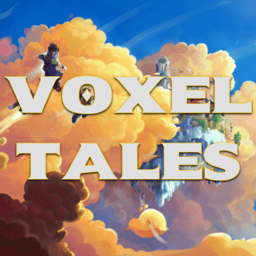

<h1 align="center">VoxelTales</h1>

  

  A Hytale mod/plugin focused on custom combat progression, weapon forging, and UI-driven gameplay systems.

---

VoxelTales is a Hytale mod/plugin that takes inspiration from the hit roblox game [VoxlBlade](https://www.roblox.com/it/games/8651781069/Voxlblade).

It is a work-in-progress mod that aims to provide a different style of combat progression for players in Hytale.

## Features
- Custom weapon and stats systems
- Player XP / leveling related logic
- UI pages for weapon configuration and forging
- HUD support for weapon progression
- Config-driven weapon/stat data
- Packet listeners, events, and registries for gameplay integration

## Project Structure
- `Components` — entity/player state components
- `Configs` — serialized game and weapon configuration data
- `Controllers` — higher-level gameplay coordination
- `Events` — event callbacks
- `PacketListeners` — packet handling hooks
- `Registries` — registration/bootstrap helpers
- `Systems` — runtime gameplay systems
- `UI` — pages, HUDs, and UI components
- `Utils` — helper and utility classes

## Requirements
- Java 25+
- Hytale server API
- HyUI
- DynamicFloatingDamageFormatter

## Notes
This project is still under active development.
More documentation will be added as the codebase settles.

## License
No license has been defined yet.
